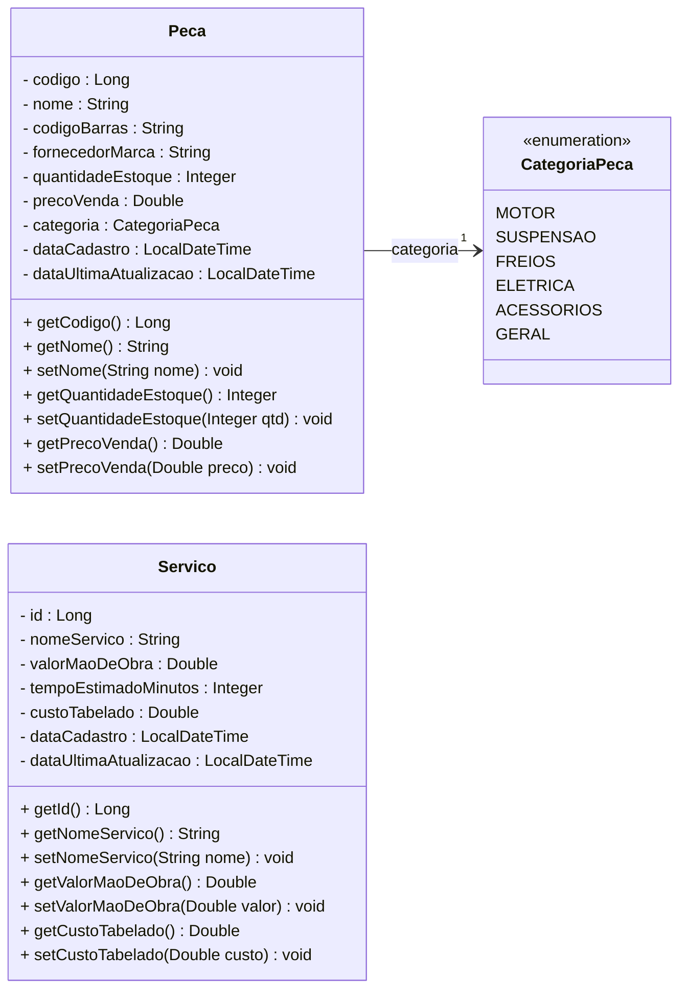
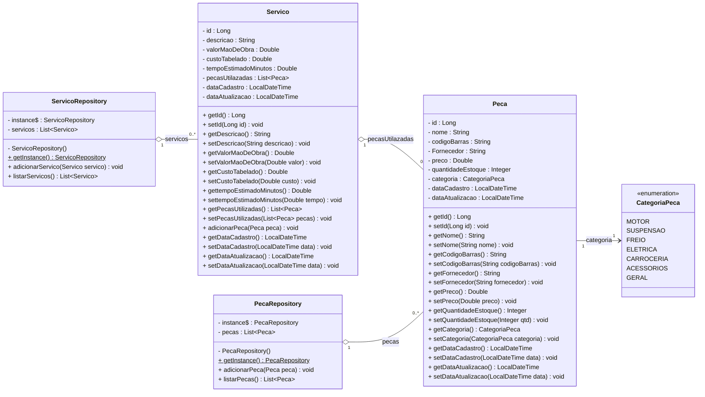

# Diagrama de Classes

## Entrega 1 — 14/08/2026 (versão original)

Diagrama de Classes com as entidades e o Enum preenchidos com atributos e modificadores de visibilidade.

Peca.java;
Servico.java;
E do Enum CategoriaPeca.java.

## Atualização — 29/08/2026 (com base no código atual)

Diagrama revisado para refletir o estado atual do código depois da entrega de hoje: nomes de atributos que mudaram em `Peca`/`Servico`, o valor `CARROCERIA` adicionado (e `FREIOS` renomeado para `FREIO`) em `CategoriaPeca`, a associação `Servico → Peca` (lista de peças utilizadas) e as novas classes `PecaRepository`/`ServicoRepository` (padrão Singleton).

**Principais diferenças em relação à versão de 14/08:**
- `Peca`: `codigo` → `id`, `fornecedorMarca` → `Fornecedor`, `precoVenda` → `preco`, `dataUltimaAtualizacao` → `dataAtualizacao`; getters/setters completos para todos os atributos.
- `Servico`: `nomeServico` → `descricao`; `tempoEstimadoMinutos` agora é `Double` (era `Integer` no diagrama); `dataUltimaAtualizacao` → `dataAtualizacao`; adicionado o atributo `pecasUtilazadas : List<Peca>` e o método `adicionarPeca(Peca)`.
- `CategoriaPeca`: `FREIOS` → `FREIO`; adicionado `CARROCERIA`.
- Novas classes `PecaRepository` e `ServicoRepository`, cada uma um Singleton (`getInstance()` estático) que guarda a lista de `Peca`/`Servico` em memória.

