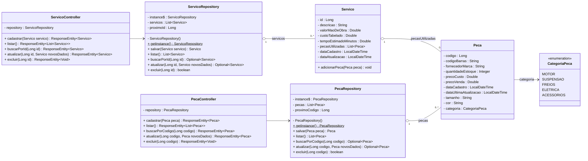

# Diagrama de Classes

Diagrama atualizado para representar a implementação atual da API, com armazenamento em memória e repositories no padrão Singleton.


## Atualização — 29/08/2026 (com base no código atual)

Diagrama revisado para refletir o estado atual do código depois das alterações realizadas até a entrega de hoje: atualização dos atributos das classes `Peca` e `Servico`, atualização dos valores do enum `CategoriaPeca`, associação entre `Servico` e `Peca` por meio da lista de peças utilizadas e inclusão das classes `PecaRepository` e `ServicoRepository`, implementadas utilizando o padrão Singleton.

**Principais diferenças em relação à versão anterior:**

- `Peca`: atualização dos atributos para refletir a implementação atual, incluindo `id`, `Fornecedor`, `quantidadeEstoque`, `precoCusto`, `preco`, `dataCadastro`, `dataAtualizacao`, `tamanho`, `cor` e `categoria`, além dos respectivos getters e setters.

- `Servico`: atualização do atributo `nomeServico` para `descricao`; `tempoEstimadoMinutos` passou a ser representado como `Double`; `dataUltimaAtualizacao` foi atualizada para `dataAtualizacao`; inclusão do atributo `pecasUtilazadas : List<Peca>` e do método `adicionarPeca(Peca)`.

- `CategoriaPeca`: atualização dos valores do enum de acordo com a implementação atual, incluindo `MOTOR`, `SUSPENSAO`, `FREIO`, `ELETRICA`, `ACESSORIOS` e `CARROCERIA`.

- `Servico → Peca`: inclusão da associação entre `Servico` e `Peca`, representando a lista de peças utilizadas em cada serviço.

- `PecaRepository` e `ServicoRepository`: inclusão das classes responsáveis pelo armazenamento das peças e serviços em memória, respectivamente, utilizando o padrão Singleton por meio do método estático `getInstance()`, além das operações de cadastro, listagem, busca, atualização e exclusão.

```mermaid
classDiagram
direction LR

class Peca {
    -Long codigo
    -String codigoBarras
    -String fornecedorMarca
    -Integer quantidadeEstoque
    -Double precoCusto
    -Double precoVenda
    -LocalDateTime dataCadastro
    -LocalDateTime dataUltimaAtualizacao
    -String tamanho
    -String cor
    -CategoriaPeca categoria

    +Peca()
    +Peca(String codigoBarras, String fornecedorMarca, Integer quantidadeEstoque, Double precoCusto, Double precoVenda, String tamanho, String cor, CategoriaPeca categoria)
    +Long getCodigo()
    +void setCodigo(Long codigo)
    +String getCodigoBarras()
    +void setCodigoBarras(String codigoBarras)
    +String getFornecedorMarca()
    +void setFornecedorMarca(String fornecedorMarca)
    +Integer getQuantidadeEstoque()
    +void setQuantidadeEstoque(Integer quantidadeEstoque)
    +Double getPrecoCusto()
    +void setPrecoCusto(Double precoCusto)
    +Double getPrecoVenda()
    +void setPrecoVenda(Double precoVenda)
    +LocalDateTime getDataCadastro()
    +void setDataCadastro(LocalDateTime dataCadastro)
    +LocalDateTime getDataUltimaAtualizacao()
    +void setDataUltimaAtualizacao(LocalDateTime dataUltimaAtualizacao)
    +String getTamanho()
    +void setTamanho(String tamanho)
    +String getCor()
    +void setCor(String cor)
    +CategoriaPeca getCategoria()
    +void setCategoria(CategoriaPeca categoria)
}

class Servico {
    -Long id
    -String descricao
    -Double valorMaoDeObra
    -Double custoTabelado
    -Double tempoEstimadoMinutos
    -List~Peca~ pecasUtilazadas
    -LocalDateTime dataCadastro
    -LocalDateTime dataAtualizacao

    +Servico()
    +Servico(Long id, String descricao, Double valorMaoDeObra, Double custoTabelado, Double tempoEstimadoMinutos, List~Peca~ pecasUtilazadas, LocalDateTime dataCadastro, LocalDateTime dataAtualizacao)
    +Long getId()
    +void setId(Long id)
    +String getDescricao()
    +void setDescricao(String descricao)
    +Double getValorMaoDeObra()
    +void setValorMaoDeObra(Double valorMaoDeObra)
    +Double getCustoTabelado()
    +void setCustoTabelado(Double custoTabelado)
    +Double gettempoEstimadoMinutos()
    +void settempoEstimadoMinutos(Double tempoEstimadoMinutos)
    +List~Peca~ getPecasUtilizadas()
    +void setPecasUtilizadas(List~Peca~ pecasUtilazadas)
    +void adicionarPeca(Peca peca)
    +LocalDateTime getDataCadastro()
    +void setDataCadastro(LocalDateTime dataCadastro)
    +LocalDateTime getDataAtualizacao()
    +void setDataAtualizacao(LocalDateTime dataAtualizacao)
}

class CategoriaPeca {
    <<enumeration>>
    MOTOR
    SUSPENSAO
    FREIOS
    ELETRICA
    ACESSORIOS
}

class PecaRepository {
    -PecaRepository instance$
    -List~Peca~ pecas
    -Long proximoCodigo
    -PecaRepository()

    +PecaRepository getInstance()$
    +Peca salvar(Peca peca)
    +List~Peca~ listar()
    +Optional~Peca~ buscarPorCodigo(Long codigo)
    +Optional~Peca~ atualizar(Long codigo, Peca novosDados)
    +boolean excluir(Long codigo)
}

class ServicoRepository {
    -ServicoRepository instance$
    -List~Servico~ servicos
    -Long proximoId
    -ServicoRepository()

    +ServicoRepository getInstance()$
    +Servico salvar(Servico servico)
    +List~Servico~ listar()
    +Optional~Servico~ buscarPorId(Long id)
    +Optional~Servico~ atualizar(Long id, Servico novosDados)
    +boolean excluir(Long id)
}

class PecaController {
    -PecaRepository repository

    +PecaController()
    +ResponseEntity~Peca~ cadastrar(Peca peca)
    +ResponseEntity~List~Peca~~ listar()
    +ResponseEntity~Peca~ buscarPorCodigo(Long codigo)
    +ResponseEntity~Peca~ atualizar(Long codigo, Peca novosDados)
    +ResponseEntity~Void~ excluir(Long codigo)
}

class ServicoController {
    -ServicoRepository repository

    +ServicoController()
    +ResponseEntity~Servico~ cadastrar(Servico servico)
    +ResponseEntity~List~Servico~~ listar()
    +ResponseEntity~Servico~ buscarPorId(Long id)
    +ResponseEntity~Servico~ atualizar(Long id, Servico novosDados)
    +ResponseEntity~Void~ excluir(Long id)
}

Peca --> CategoriaPeca : categoria
Servico "1" o-- "0..*" Peca : pecasUtilazadas

PecaController --> PecaRepository : utiliza
ServicoController --> ServicoRepository : utiliza

PecaRepository "1" o-- "0..*" Peca : pecas
ServicoRepository "1" o-- "0..*" Servico : servicos