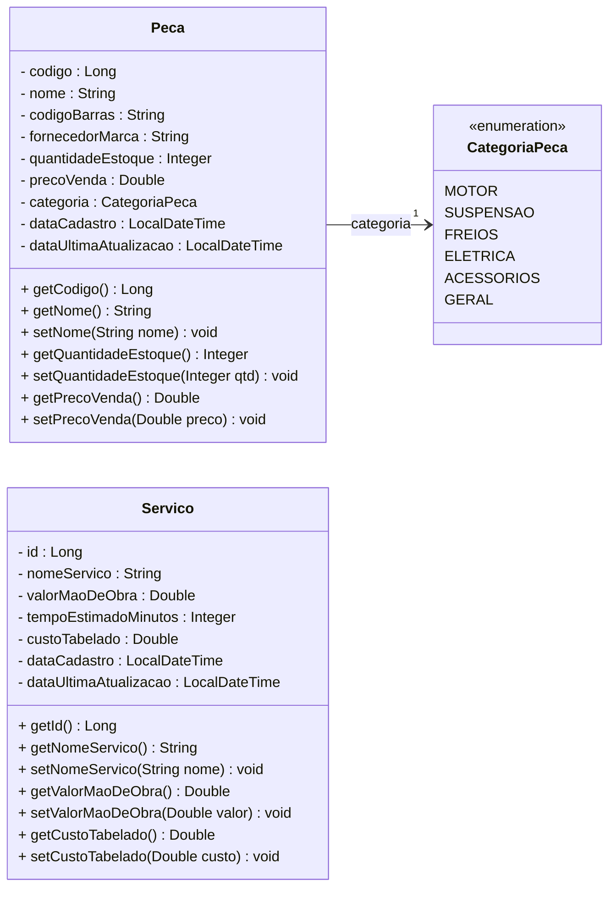

# Diagrama de Classes

Entrega 1, aula dia 14/08/2026

Diagrama de Classes com as entidades e o Enum preenchidos com atributos e modificadores de visibilidade.

Peca.java; 
Servico.java; 
E do Enum CategoriaPeca.java.

